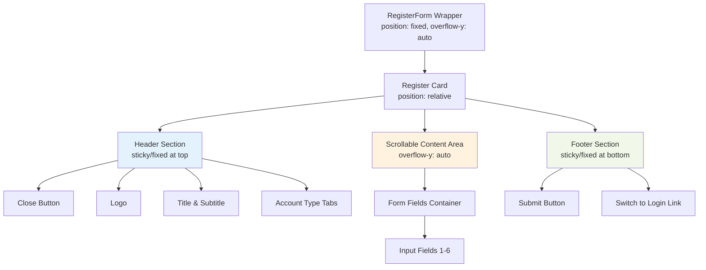
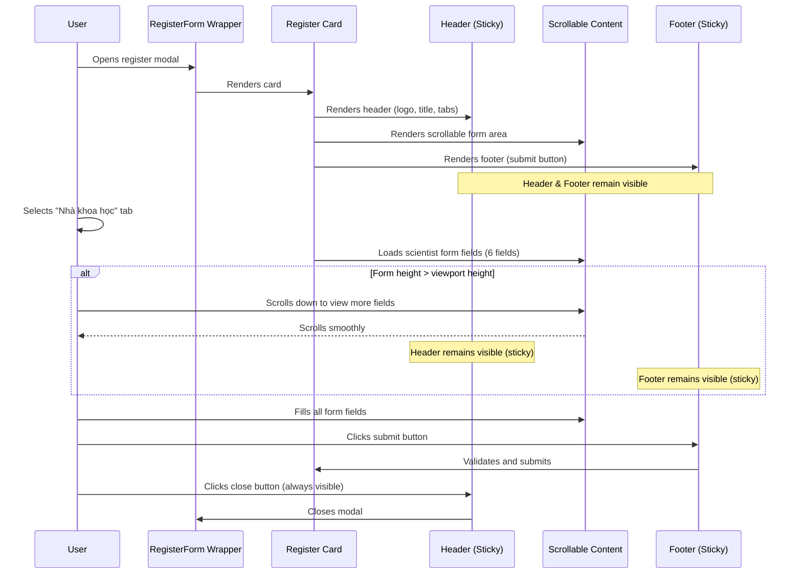

# Design Document: Researcher Registration Form Scroll Improvement

## Overview

Cải thiện giao diện form đăng ký tab "Nhà khoa học" trong RegisterForm component để giải quyết các vấn đề về khả năng cuộn (scroll), hiển thị icon thoát, và trải nghiệm người dùng khi form có nhiều trường input. Form hiện tại sử dụng `position: fixed` gây ra vấn đề khi nội dung vượt quá chiều cao viewport, khiến người dùng không thể cuộn để nhập liệu hoặc nhìn thấy nút submit.

Giải pháp thiết kế sẽ tập trung vào việc tạo vùng nội dung form có thể cuộn được trong khi vẫn giữ các phần tử quan trọng (logo, title, tabs, close button, submit button) cố định hoặc luôn hiển thị.

## Architecture



## Sequence Diagrams

### User Interaction Flow with Scrollable Form



## Components and Interfaces

### Component 1: RegisterForm Wrapper

**Purpose**: Container cho toàn bộ modal với khả năng center nội dung và xử lý overlay

**Interface**:
```jsx
<div className="register-form-wrapper">
  <div className="register-form-overlay" />
  <div className="register-form-card">
    {/* Content */}
  </div>
</div>
```

**SCSS Structure**:
```scss
.register-form-wrapper {
  position: fixed;
  top: 0;
  left: 0;
  right: 0;
  bottom: 0;
  display: flex;
  align-items: center;
  justify-content: center;
  padding: $space-4;
  overflow-y: auto; // Allows scrolling if card is too tall
  z-index: 1000;
}
```

**Responsibilities**:
- Hiển thị overlay mờ phía sau form
- Center form card trong viewport
- Cho phép cuộn khi card cao hơn viewport

### Component 2: Register Card with Internal Scroll

**Purpose**: Container chính cho form với cấu trúc header sticky + scrollable content + footer sticky

**Interface**:
```jsx
<div className="register-form-card">
  <CloseButton className="register-form-close-btn" />
  
  {/* Header Section - Sticky */}
  <div className="register-form-header">
    <div className="register-form-logo">...</div>
    <h1 className="register-form-title">...</h1>
    <p className="register-form-subtitle">...</p>
    <div className="register-form-tabs">...</div>
  </div>
  
  {/* Scrollable Content */}
  <div className="register-form-content">
    <div className="register-form">
      {/* Form fields */}
    </div>
  </div>
  
  {/* Footer Section - Sticky */}
  <div className="register-form-footer-actions">
    <Button className="register-form-submit">...</Button>
    <div className="register-form-footer">...</div>
  </div>
</div>
```

**SCSS Structure**:
```scss
.register-form-card {
  position: relative;
  background: $bg-card;
  border-radius: $radius-xl;
  box-shadow: $shadow-xl;
  width: 100%;
  max-width: 420px;
  max-height: 90vh; // Prevent card from being taller than viewport
  display: flex;
  flex-direction: column;
  overflow: hidden; // Hide overflow to contain scrollable area
}

.register-form-header {
  position: sticky;
  top: 0;
  background: $bg-card;
  z-index: 10;
  padding: $space-6 $space-6 0 $space-6;
  border-bottom: 1px solid transparent; // Space for visual separation
}

.register-form-content {
  flex: 1;
  overflow-y: auto; // Scrollable area
  padding: $space-4 $space-6;
  
  // Custom scrollbar styling
  &::-webkit-scrollbar {
    width: 6px;
  }
  
  &::-webkit-scrollbar-track {
    background: #f1f5f9;
    border-radius: 3px;
  }
  
  &::-webkit-scrollbar-thumb {
    background: #cbd5e1;
    border-radius: 3px;
    
    &:hover {
      background: #94a3b8;
    }
  }
}

.register-form-footer-actions {
  position: sticky;
  bottom: 0;
  background: $bg-card;
  z-index: 10;
  padding: 0 $space-6 $space-6 $space-6;
  border-top: 1px solid $border-default;
}
```

**Responsibilities**:
- Giới hạn chiều cao tối đa (90vh) để không vượt quá viewport
- Sử dụng flexbox để chia layout thành header, content, footer
- Header và footer sticky để luôn hiển thị
- Content area có overflow-y: auto để cuộn được

### Component 3: Close Button

**Purpose**: Nút đóng modal luôn hiển thị ở góc trên phải

**Interface**:
```jsx
<CloseButton 
  onClick={onClose} 
  variant="light" 
  size="sm" 
  position="top-right-inside"
  ariaLabel="Đóng"
  className="register-form-close-btn"
/>
```

**SCSS Structure**:
```scss
.register-form-close-btn {
  position: absolute;
  top: $space-4;
  right: $space-4;
  z-index: 20; // Above header
  background: rgba(255, 255, 255, 0.9);
  box-shadow: $shadow-sm;
  
  &:hover {
    background: rgba(255, 255, 255, 1);
  }
}
```

**Responsibilities**:
- Luôn hiển thị ở góc trên phải với z-index cao
- Không bị che khuất bởi bất kỳ phần tử nào
- Có background để dễ nhìn thấy

## Data Models

### Form State Model

```typescript
interface ScientistFormState {
  hoTen: string;           // Họ và tên
  email: string;           // Email
  soDienThoai: string;     // Số điện thoại
  donViCongTac: string;    // Đơn vị công tác/nghiên cứu
  tinhTrangCongTac: string; // Tình trạng công tác
  password: string;        // Mật khẩu
}

interface FormErrors {
  [key: string]: string;   // Field name -> Error message
}

interface RegisterFormProps {
  onSuccess?: () => void;
  onClose?: () => void;
  onSwitchToLogin?: () => void;
}
```

**Validation Rules**:
- `hoTen`: Required, non-empty string
- `email`: Required, valid email format
- `soDienThoai`: Required, 10-11 digits
- `donViCongTac`: Required, non-empty string
- `tinhTrangCongTac`: Required, one of ["Dang cong tac", "Da nghi huu"]
- `password`: Required, minimum 8 characters

## Algorithmic Pseudocode

### Main Layout Rendering Algorithm

```pascal
ALGORITHM renderRegisterFormLayout
INPUT: activeTab (string), formData (object), errors (object)
OUTPUT: JSX structure with scrollable layout

BEGIN
  // Step 1: Calculate if content needs scrolling
  totalFields ← getFieldCountForTab(activeTab)
  estimatedContentHeight ← totalFields × FIELD_HEIGHT + SPACING
  viewportHeight ← window.innerHeight
  needsScroll ← estimatedContentHeight > (viewportHeight × 0.9)
  
  // Step 2: Render wrapper with overlay
  RENDER Wrapper {
    position: fixed,
    display: flex,
    alignItems: center,
    justifyContent: center,
    overflow-y: auto
  }
  
  // Step 3: Render card with max-height constraint
  RENDER Card {
    maxHeight: "90vh",
    display: flex,
    flexDirection: column,
    overflow: hidden
  }
  
  // Step 4: Render sticky header section
  RENDER Header {
    position: sticky,
    top: 0,
    zIndex: 10,
    background: white
  } CONTAINING {
    CloseButton (position: absolute, zIndex: 20),
    Logo,
    Title,
    Subtitle,
    Tabs
  }
  
  // Step 5: Render scrollable content section
  RENDER Content {
    flex: 1,
    overflowY: auto,
    padding: standard
  } CONTAINING {
    IF activeTab = 'nhakhoahoc' THEN
      RENDER ScientistFormFields
    ELSE IF activeTab = 'sinhvien' THEN
      RENDER StudentFormFields
    ELSE IF activeTab = 'canbo' THEN
      RENDER StaffFormFields
    ELSE
      RENDER SponsorFormFields
    END IF
  }
  
  // Step 6: Render sticky footer section
  RENDER Footer {
    position: sticky,
    bottom: 0,
    zIndex: 10,
    background: white,
    borderTop: solid
  } CONTAINING {
    SubmitButton,
    SwitchToLoginLink
  }
  
  RETURN JSX structure
END
```

**Preconditions**:
- activeTab is one of ['sinhvien', 'nhataitro', 'canbo', 'nhakhoahoc']
- formData contains valid field values for the active tab
- errors object contains validation error messages (if any)

**Postconditions**:
- Returns complete JSX structure with scrollable layout
- Header and footer remain visible when scrolling
- Close button is always accessible
- Content area scrolls when form height exceeds viewport

**Loop Invariants**: N/A (no loops in rendering logic)

### Scroll Behavior Detection Algorithm

```pascal
ALGORITHM detectScrollBehavior
INPUT: contentRef (DOM reference to scrollable content)
OUTPUT: scrollState (object with scroll information)

BEGIN
  scrollableElement ← contentRef.current
  
  IF scrollableElement = null THEN
    RETURN { canScroll: false, isScrolling: false, scrollPercentage: 0 }
  END IF
  
  // Get scroll metrics
  scrollTop ← scrollableElement.scrollTop
  scrollHeight ← scrollableElement.scrollHeight
  clientHeight ← scrollableElement.clientHeight
  
  // Calculate scroll state
  canScroll ← scrollHeight > clientHeight
  isScrolling ← scrollTop > 0
  scrollPercentage ← (scrollTop / (scrollHeight - clientHeight)) × 100
  
  // Determine if user has scrolled to bottom
  isAtBottom ← (scrollTop + clientHeight) >= (scrollHeight - 10) // 10px threshold
  
  RETURN {
    canScroll: canScroll,
    isScrolling: isScrolling,
    scrollPercentage: scrollPercentage,
    isAtBottom: isAtBottom
  }
END
```

**Preconditions**:
- contentRef is a valid React ref attached to scrollable element
- DOM element exists and is mounted

**Postconditions**:
- Returns accurate scroll state information
- scrollPercentage is between 0 and 100
- isAtBottom is true when user scrolled near bottom (within 10px)

**Loop Invariants**: N/A (no loops)

### Form Submission Validation Algorithm

```pascal
ALGORITHM validateScientistForm
INPUT: formData (ScientistFormState object)
OUTPUT: validationResult (object with isValid boolean and errors object)

BEGIN
  errors ← empty object
  
  // Validate each field
  IF formData.hoTen.trim() = "" THEN
    errors.hoTen ← "Vui lòng nhập họ và tên"
  END IF
  
  IF formData.email.trim() = "" THEN
    errors.email ← "Vui lòng nhập email"
  ELSE IF NOT isValidEmail(formData.email) THEN
    errors.email ← "Email không hợp lệ"
  END IF
  
  IF formData.soDienThoai.trim() = "" THEN
    errors.soDienThoai ← "Vui lòng nhập số điện thoại"
  ELSE IF NOT matches(formData.soDienThoai, "^[0-9]{10,11}$") THEN
    errors.soDienThoai ← "Số điện thoại không hợp lệ"
  END IF
  
  IF formData.donViCongTac.trim() = "" THEN
    errors.donViCongTac ← "Vui lòng nhập đơn vị công tác"
  END IF
  
  IF formData.password = "" THEN
    errors.password ← "Vui lòng nhập mật khẩu"
  ELSE IF length(formData.password) < 8 THEN
    errors.password ← "Mật khẩu phải có ít nhất 8 ký tự"
  END IF
  
  isValid ← (size(errors) = 0)
  
  RETURN {
    isValid: isValid,
    errors: errors
  }
END

FUNCTION isValidEmail(email)
  RETURN matches(email, "^[^\s@]+@[^\s@]+\.[^\s@]+$")
END FUNCTION
```

**Preconditions**:
- formData is a valid ScientistFormState object
- All fields are defined (may be empty strings)

**Postconditions**:
- Returns validation result with isValid boolean
- If isValid is false, errors object contains field-specific error messages
- If isValid is true, errors object is empty

**Loop Invariants**: N/A (no loops)

## Key Functions with Formal Specifications

### Function 1: renderScrollableCard()

```jsx
function renderScrollableCard(): JSX.Element
```

**Preconditions:**
- Component is mounted and activeTab state is set
- Form data states (scientistForm, studentForm, etc.) are initialized
- Props (onClose, onSuccess, onSwitchToLogin) are valid functions or undefined

**Postconditions:**
- Returns JSX element with scrollable layout structure
- Header section is sticky at top with close button
- Content section has overflow-y: auto
- Footer section is sticky at bottom
- Close button has z-index higher than header

**Loop Invariants:** N/A

### Function 2: handleScroll()

```jsx
function handleScroll(event: React.UIEvent<HTMLDivElement>): void
```

**Preconditions:**
- Event is fired from scrollable content element
- Scrollable element has valid scrollTop, scrollHeight, clientHeight properties

**Postconditions:**
- Updates scroll state if needed (for visual indicators)
- No side effects on form data
- Performance optimized with debouncing if necessary

**Loop Invariants:** N/A

### Function 3: adjustCardHeight()

```jsx
function adjustCardHeight(availableHeight: number): string
```

**Preconditions:**
- availableHeight is window.innerHeight or viewport height in pixels
- availableHeight > 0

**Postconditions:**
- Returns CSS value for max-height (e.g., "90vh" or "800px")
- Ensures card never exceeds 90% of viewport height
- Minimum height is maintained for usability

**Loop Invariants:** N/A

## Example Usage

### Example 1: Basic Scientist Form Rendering

```jsx
// In RegisterForm component
<div className="register-form-wrapper">
  <div className="register-form-overlay" />
  
  <div className="register-form-card">
    {/* Close button - always visible */}
    <CloseButton 
      onClick={onClose} 
      className="register-form-close-btn"
    />
    
    {/* Sticky header */}
    <div className="register-form-header">
      <Logo size="xl" variant="icon-only" animated />
      <h1 className="register-form-title">TẠO TÀI KHOẢN MỚI</h1>
      <p className="register-form-subtitle">
        Tham gia hệ thống quản lý tài chính TVU
      </p>
      <div className="register-form-tabs">
        {/* Tab buttons */}
      </div>
    </div>
    
    {/* Scrollable content */}
    <div className="register-form-content">
      <div className="register-form">
        {/* 6 form fields for scientist */}
        <InputField label="HỌ VÀ TÊN" />
        <InputField label="EMAIL" />
        <InputField label="SỐ ĐIỆN THOẠI" />
        <InputField label="ĐƠN VỊ CÔNG TÁC" />
        <SelectField label="TÌNH TRẠNG CÔNG TÁC" />
        <InputField label="MẬT KHẨU" type="password" />
      </div>
    </div>
    
    {/* Sticky footer */}
    <div className="register-form-footer-actions">
      <Button onClick={handleSubmit}>ĐĂNG KÝ NGAY</Button>
      <div className="register-form-footer">
        <span>Đã có tài khoản?</span>
        <button onClick={onSwitchToLogin}>Đăng nhập</button>
      </div>
    </div>
  </div>
</div>
```

### Example 2: SCSS Layout Implementation

```scss
// Card with internal scroll
.register-form-card {
  position: relative;
  display: flex;
  flex-direction: column;
  width: 100%;
  max-width: 420px;
  max-height: 90vh; // Key constraint
  background: white;
  border-radius: 16px;
  box-shadow: 0 20px 60px rgba(0, 0, 0, 0.15);
  overflow: hidden; // Contain internal scroll
}

// Sticky header
.register-form-header {
  position: sticky;
  top: 0;
  z-index: 10;
  background: white;
  padding: 24px 24px 0 24px;
  
  // Subtle shadow when scrolling
  &::after {
    content: '';
    position: absolute;
    bottom: 0;
    left: 0;
    right: 0;
    height: 1px;
    background: linear-gradient(to bottom, 
      rgba(0, 0, 0, 0.05), 
      transparent
    );
  }
}

// Scrollable content
.register-form-content {
  flex: 1; // Take remaining space
  overflow-y: auto; // Enable scrolling
  padding: 16px 24px;
  
  // Custom scrollbar
  &::-webkit-scrollbar {
    width: 6px;
  }
  
  &::-webkit-scrollbar-track {
    background: #f1f5f9;
    border-radius: 3px;
  }
  
  &::-webkit-scrollbar-thumb {
    background: #cbd5e1;
    border-radius: 3px;
    
    &:hover {
      background: #94a3b8;
    }
  }
}

// Sticky footer
.register-form-footer-actions {
  position: sticky;
  bottom: 0;
  z-index: 10;
  background: white;
  padding: 0 24px 24px 24px;
  border-top: 1px solid #e5e7eb;
  
  // Subtle shadow when not at bottom
  &::before {
    content: '';
    position: absolute;
    top: 0;
    left: 0;
    right: 0;
    height: 1px;
    background: linear-gradient(to top, 
      rgba(0, 0, 0, 0.05), 
      transparent
    );
  }
}

// Close button always visible
.register-form-close-btn {
  position: absolute;
  top: 16px;
  right: 16px;
  z-index: 20; // Above everything
  background: rgba(255, 255, 255, 0.9);
  backdrop-filter: blur(4px);
  box-shadow: 0 2px 8px rgba(0, 0, 0, 0.1);
  
  &:hover {
    background: white;
    box-shadow: 0 4px 12px rgba(0, 0, 0, 0.15);
  }
}
```

### Example 3: Responsive Behavior

```jsx
// Hook to adjust card height on resize
useEffect(() => {
  const handleResize = () => {
    const vh = window.innerHeight * 0.01;
    document.documentElement.style.setProperty('--vh', `${vh}px`);
  };
  
  handleResize();
  window.addEventListener('resize', handleResize);
  
  return () => window.removeEventListener('resize', handleResize);
}, []);
```

```scss
// Use CSS custom property for mobile viewport height
.register-form-card {
  max-height: calc(var(--vh, 1vh) * 90); // Fallback to 90vh
  
  @media (max-width: 640px) {
    max-height: calc(var(--vh, 1vh) * 95); // Use more space on mobile
    border-radius: 12px;
  }
}
```

## Correctness Properties

### Property 1: Scroll Accessibility
**∀ formState, viewport: IF contentHeight(formState) > viewportHeight(viewport) × 0.9 THEN scrollable(content) = true**

Mọi trạng thái form, nếu nội dung cao hơn 90% viewport thì vùng content phải có khả năng cuộn.

### Property 2: Header Visibility
**∀ scrollPosition: visible(header) = true ∧ visible(closeButton) = true**

Với mọi vị trí cuộn, header và close button luôn hiển thị.

### Property 3: Footer Visibility
**∀ scrollPosition: visible(footer) = true ∧ accessible(submitButton) = true**

Với mọi vị trí cuộn, footer và submit button luôn hiển thị và có thể click được.

### Property 4: No Content Clipping
**∀ formField ∈ formFields: accessible(formField) = true WHEN scrolled**

Mọi trường form đều có thể truy cập bằng cách cuộn.

### Property 5: Vertical Overflow Containment
**overflowY(wrapper) = 'auto' ∧ overflowY(content) = 'auto' ∧ overflowY(card) = 'hidden'**

Wrapper cho phép cuộn toàn bộ modal, content area cho phép cuộn nội dung bên trong, card container ẩn overflow để chứa scroll.

### Property 6: Z-Index Hierarchy
**zIndex(closeButton) > zIndex(header) > zIndex(content) ∧ zIndex(footer) > zIndex(content)**

Close button có z-index cao nhất, header và footer cao hơn content.

### Property 7: Mobile Responsiveness
**∀ viewport WHERE width(viewport) ≤ 640px: maxHeight(card) = 95vh ∧ padding(card) = reduced**

Trên mobile, card sử dụng tối đa 95vh và padding giảm để tối ưu không gian.

## Error Handling

### Error Scenario 1: Content Overflow on Small Screens

**Condition**: Viewport height < 500px và form có nhiều fields
**Response**: 
- Card tự động điều chỉnh max-height thành 95vh
- Padding giảm từ 24px xuống 16px
- Font size có thể giảm nhẹ
- Scrollbar luôn hiện để người dùng biết có thể cuộn

**Recovery**: Layout tự động điều chỉnh responsive, không cần user intervention

### Error Scenario 2: CloseButton bị che khuất

**Condition**: Scroll position thay đổi hoặc content tràn ra ngoài
**Response**: 
- Close button có `position: absolute` với `z-index: 20`
- Luôn nằm trong card boundary
- Có background và shadow để nổi bật

**Recovery**: CSS đảm bảo close button luôn hiển thị, không cần JavaScript fix

### Error Scenario 3: Submit Button không thấy được

**Condition**: Form quá dài, user chưa scroll xuống cuối
**Response**: 
- Footer sticky bottom đảm bảo submit button luôn hiển thị
- Không cần scroll xuống cuối để thấy nút submit

**Recovery**: Layout tự xử lý, submit button luôn accessible

### Error Scenario 4: Scrollbar không hoạt động trên iOS

**Condition**: iOS Safari có hành vi scroll khác desktop
**Response**: 
- Thêm `-webkit-overflow-scrolling: touch` cho smooth scroll
- Test trên iOS để đảm bảo scroll behavior đúng
- Fallback: Wrapper scroll vẫn hoạt động

**Recovery**: Progressive enhancement, có nhiều layer scroll fallback

## Testing Strategy

### Unit Testing Approach

**Test Cases**:
1. **Component Rendering**
   - Verify RegisterForm renders with all sections (header, content, footer)
   - Verify close button is present and positioned correctly
   - Verify correct tab content renders based on activeTab state

2. **Layout Structure**
   - Verify header has sticky positioning
   - Verify content has overflow-y: auto
   - Verify footer has sticky positioning
   - Verify z-index hierarchy is correct

3. **Form Validation**
   - Test validateScientistForm with valid data → returns { isValid: true, errors: {} }
   - Test validateScientistForm with empty fields → returns appropriate error messages
   - Test email format validation
   - Test phone number format validation (10-11 digits)
   - Test password length validation (minimum 8 characters)

4. **State Management**
   - Test form field changes update state correctly
   - Test tab switching clears errors
   - Test error state updates on validation

**Coverage Goals**: 85%+ code coverage for component logic and validation functions

### Property-Based Testing Approach

**Property Test Library**: fast-check (JavaScript/React)

**Property Tests**:

1. **Scroll Behavior Property**
   ```javascript
   // Property: Content with height > 90vh should be scrollable
   fc.assert(
     fc.property(
       fc.integer({ min: 400, max: 2000 }), // viewport height
       fc.integer({ min: 1, max: 20 }),      // number of form fields
       (viewportHeight, fieldCount) => {
         const fieldHeight = 80; // approx height per field
         const contentHeight = fieldCount * fieldHeight + 200; // +200 for padding/spacing
         const maxCardHeight = viewportHeight * 0.9;
         
         if (contentHeight > maxCardHeight) {
           // Content should be scrollable
           const needsScroll = contentHeight > maxCardHeight;
           expect(needsScroll).toBe(true);
         }
         
         return true;
       }
     )
   );
   ```

2. **Form Validation Property**
   ```javascript
   // Property: Invalid email format always fails validation
   fc.assert(
     fc.property(
       fc.string({ minLength: 1, maxLength: 50 }),
       (emailLike) => {
         // Generate invalid emails (no @ or no domain)
         const invalidEmail = emailLike.replace(/@/g, '').replace(/\./g, '');
         const result = validateScientistForm({
           hoTen: 'Test User',
           email: invalidEmail,
           soDienThoai: '0901234567',
           donViCongTac: 'Test Unit',
           tinhTrangCongTac: 'Dang cong tac',
           password: 'password123'
         });
         
         if (!invalidEmail.includes('@') || !invalidEmail.includes('.')) {
           expect(result.isValid).toBe(false);
           expect(result.errors.email).toBeDefined();
         }
         
         return true;
       }
     )
   );
   ```

3. **Z-Index Hierarchy Property**
   ```javascript
   // Property: Close button always has highest z-index
   fc.assert(
     fc.property(
       fc.record({
         headerZIndex: fc.integer({ min: 1, max: 15 }),
         contentZIndex: fc.integer({ min: 1, max: 5 }),
         footerZIndex: fc.integer({ min: 1, max: 15 })
       }),
       (zIndexes) => {
         const closeButtonZIndex = 20;
         
         expect(closeButtonZIndex).toBeGreaterThan(zIndexes.headerZIndex);
         expect(closeButtonZIndex).toBeGreaterThan(zIndexes.contentZIndex);
         expect(closeButtonZIndex).toBeGreaterThan(zIndexes.footerZIndex);
         
         return true;
       }
     )
   );
   ```

### Integration Testing Approach

**Integration Test Scenarios**:

1. **User Journey: Complete Registration Flow**
   - User opens modal → Modal renders with correct layout
   - User selects "Nhà khoa học" tab → Form switches to scientist fields
   - User scrolls down → Content scrolls smoothly, header/footer remain visible
   - User fills all fields → Form state updates correctly
   - User submits → Validation runs, API call triggered
   - User closes modal → Modal closes, state resets

2. **Responsive Behavior Test**
   - Test on desktop viewport (1920x1080) → Layout is centered, max-width: 420px
   - Test on tablet viewport (768x1024) → Layout adapts, still scrollable
   - Test on mobile viewport (375x667) → Card uses 95vh, reduced padding
   - Test on very small screen (320x568) → Content still accessible via scroll

3. **Accessibility Test**
   - Keyboard navigation: Tab through all form fields
   - Screen reader: All labels and error messages are announced
   - Focus management: Close button and submit button are reachable
   - Color contrast: All text meets WCAG AA standards

**Tools**: React Testing Library, Cypress/Playwright for E2E tests

## Performance Considerations

### Optimization 1: Efficient Scroll Event Handling

- Use debouncing for scroll event listeners (if needed for visual indicators)
- Avoid unnecessary re-renders on scroll
- Use `will-change: transform` on scrollable content for smooth performance

```jsx
const handleScroll = useCallback(
  debounce((e) => {
    // Update scroll state if needed
    // Only fires every 100ms max
  }, 100),
  []
);
```

### Optimization 2: CSS Performance

- Use `transform` and `opacity` for animations (GPU accelerated)
- Avoid `box-shadow` on elements that change frequently
- Use `contain: layout style` on card to limit reflow scope

```scss
.register-form-card {
  contain: layout style;
  will-change: scroll-position;
}
```

### Optimization 3: Lazy Rendering

- Only render active tab's form fields
- Unmount inactive tabs to reduce DOM size
- Use React.memo for form field components if re-renders are frequent

### Optimization 4: Mobile Viewport Height Fix

- Use `vh` units with JavaScript fallback for iOS viewport height issue
- Cache calculated viewport height
- Update only on orientation change

```javascript
useEffect(() => {
  const handleResize = throttle(() => {
    const vh = window.innerHeight * 0.01;
    document.documentElement.style.setProperty('--vh', `${vh}px`);
  }, 200);
  
  handleResize();
  window.addEventListener('resize', handleResize);
  window.addEventListener('orientationchange', handleResize);
  
  return () => {
    window.removeEventListener('resize', handleResize);
    window.removeEventListener('orientationchange', handleResize);
  };
}, []);
```

## Security Considerations

### Consideration 1: Input Validation

- All form inputs are validated client-side before submission
- Email format validation prevents script injection in email field
- Phone number validation ensures only digits are accepted
- Password minimum length enforces basic security

**Mitigation**: Server-side validation is still required as client-side validation can be bypassed

### Consideration 2: XSS Prevention

- React automatically escapes string values in JSX
- No dangerouslySetInnerHTML used in form component
- User input is never directly rendered as HTML

**Mitigation**: Continue using React's built-in XSS protection, avoid unsafe practices

### Consideration 3: Credential Exposure

- Password field uses `type="password"` to mask input
- Password is not logged or displayed in console
- Form data is cleared after successful submission

**Mitigation**: Ensure password is transmitted over HTTPS only, use proper authentication token management

## Dependencies

### React Dependencies
- `react` (^18.x): Core framework
- `react-router-dom` (^6.x): Navigation after successful registration
- `react-toastify` (^9.x): Success/error notifications

### UI Component Dependencies
- `@components/common/Logo`: Logo component
- `@components/common/Button`: Button component with loading state
- `@components/common/CloseButton`: Close button component
- `react-icons/hi2`: Icons for form fields

### Service Dependencies
- `@services/authService`: API service for registration
- `@services/api`: Base API client
- `@stores/authStore`: Zustand store for authentication state

### Styling Dependencies
- `@styles/variables`: SCSS variables (colors, spacing, typography)
- Sass/SCSS preprocessor

### Browser API Dependencies
- `window.innerHeight`: For viewport height calculation
- `ResizeObserver` or resize event: For responsive behavior
- CSS custom properties (`--vh`): For mobile viewport height fix

### No Additional Dependencies Required
- No new NPM packages needed for scroll functionality
- Pure CSS solution with existing React patterns
- Leverages browser's native scroll behavior
